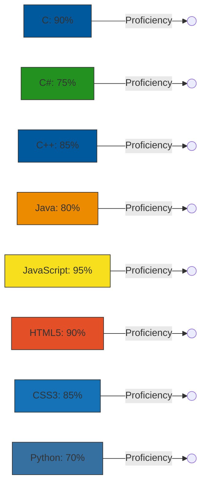

# JIMMY_JAMES 

  

---

#---> :
class SecurityResearcher:     def __init__(self):         self.alias = "James Muriithi"         self.focus = ["Automation", "Offensive Security", "Exploit Dev"]         self.tools = ["Python", "JavaScript", "C++"]         self.objective = "Bridging the gap between automated systems and manual exploitation."      def mission_statement(self):         return "Turning vulnerabilities into documented findings through code."  # Offensive only when it matters.

---

## 🌐 Socials:
 

# 💻 Tech Stack:
         
---

---

🐧 
> "Talk is cheap. Show me the code." - Linus Torvalds

  

---

